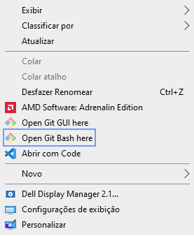
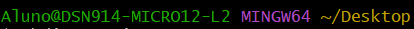

#  Como entrar no Git Bash
Primeiramente, você terá que clicar com o botão direito na pasta em que esta seu projeto, ou em qualquer outro lugar do seu explorador de arquivo, e procurar nas opções que irá aparecer a opção "Open Git Bash here", destacado em Azul na imagem! 

# Comandos básicos do Git  
 
Nesta imagem podemos ver algumas imagens que o Git nos fornece, como o nome que esta atribuido á maquina que esta em Verde, e o que está em Laranja, mostra o diretório/caminho em que você está.

# Comandos básicos para projetos no Git  

    git init -> inicializa um repositório git localmente 

    git config -> Aplica uma configuração

        . . . --local -> apenas para o projeto atual

        . . . --global -> para qualquer projeto

                . . . user.name -> nome do autor 

                . . . user.email -> email do autor

        . . . --list -> lista de configurações

    code . ->  Abre o VsCode de acordo com a pasta que está.